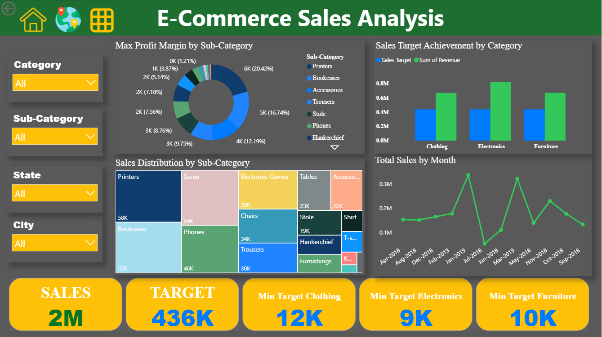
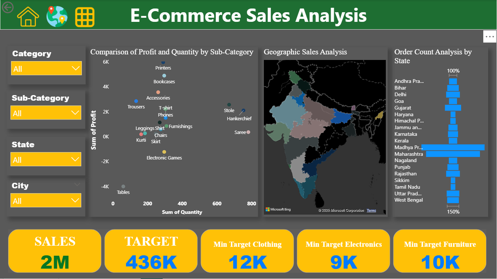
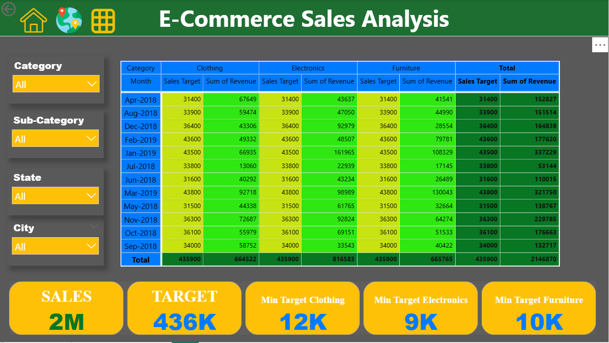

# Sales Data Visualization Dashboard (Power BI)

## 📊 Project Overview

This project focuses on building an interactive dashboard using Power BI to visualize sales data and identify key business insights. The dashboard allows users to explore sales trends, compare performance across categories, and monitor overall business metrics.

## 🎯 Objective

* Build a professional dashboard using Power BI
* Visualize key sales metrics
* Identify trends and patterns in sales performance
* Enable interactive data exploration

## 🛠 Tools & Technologies

* Power BI
* Data Visualization
* Data Modeling
* Interactive Dashboard Design

## 📁 Dataset

The dataset contains sales information including:

* Product categories
* Sales values
* Regions
* Time-based sales data

## 📈 Analysis Performed

* Sales trend analysis
* Category-wise performance comparison
* Regional sales analysis
* KPI visualization

## 📊 Dashboard Preview

## 💡 Key Insights

* Sales Performance: Total sales stand at 2M, exceeding the target of 436K, indicating strong overall performance.
* Category Performance:
  * Electronics shows high sales target achievement.
  * Clothing and Furniture also show good performance, though relatively lower compared to Electronics.
* Sub-Category Highlights:
  * Printers have the highest max profit margin (20.42%).
  * Bookcases and Accessories also show notable profit margins.
  * Printers and Phones have significant sales distribution.
* Geographic Insights:
  * Maharashtra and Tamil Nadu appear to have higher order counts.
  * Geographic sales analysis indicates varied performance across states.
* Monthly Trends:
  * Sales fluctuate month-on-month, with peaks in certain periods.
  * January 2019 shows strong sales across categories.

## 📂 Repository Structure

dataset/
sales_dataset.csv

dashboard/
sales_dashboard_page_1.png
sales_dashboard_page_2.png
sales_dashboard_page_3.png

powerbi_file/
sales_dashboard.pbix

README.md

## 🚀 Skills Demonstrated

* Data Visualization
* Business Intelligence
* Dashboard Development
* Power BI Data Modeling

## 📌 Conclusion

This project demonstrates how Power BI can be used to transform raw sales data into meaningful visual insights that support data-driven decision making.
